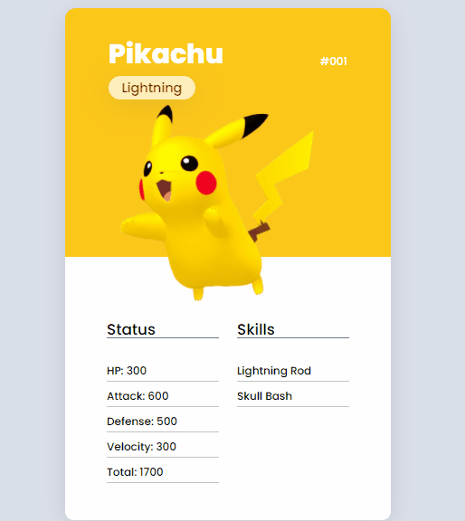
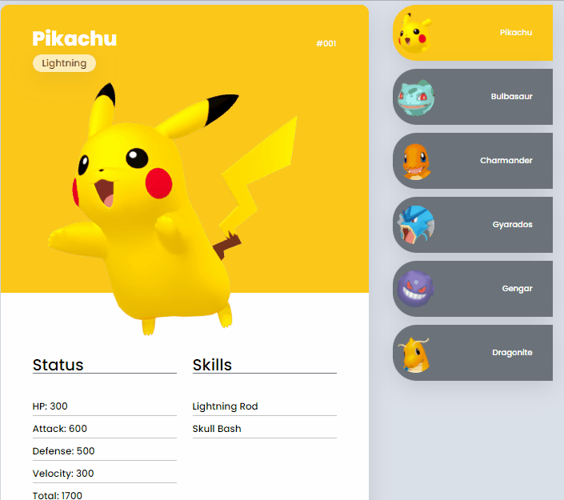

  

<h1 align='center'> Pokedex </h1>

	
	
	

_Para a versão em Português, clique [aqui](#portuguese)._

### Topics

- [Project description](#project-description)

- [Technologies used](#technologies-used)

- [What I learned](#what-I-learned)

- [Access the Project](#access-the-project)

- [Features](#features)

- [Application](#aplication)

## Project description

It is a pokemon card deck where the player can choose his card according to the pokemon's abilities. This project was created duringthe 'mapa dev week' free course event of [DevQuest](https://devemdobro.com/lista/).

## Technologies used

  
  
  

## What I learned

- Make the selected card appear and the others remain hidden, using the arrow function.

## Access the Project

You can [access and test the project here](https://bo83dev.github.io/pokedex-project/) 

Mobile

Desktop 

<h1 align='center'> Pokedex </h1>

	
	
	

### Tópicos 

- [Descrição do projeto](#descrição-do-projeto)

- [Tecnologias utilizadas](#tecnologias-utilizadas)

- [O que aprendi](#o-que-aprendi)

- [Acesse o projeto](#acesse-o-projeto)

## Descrição do projeto 

É um baralho de cartas pokemon onde o jogador pode escolher sua carta de acordo com as habilidades do pokemon. Esse projeto foi desenvolvido durante a 'Mapa DevWeek', evento gratuito do curso [DevQuest](https://devemdobro.com/lista/).

## Tecnologias utilizadas

  
  
  

## O que aprendi

- Fazer o card selecionado aparecer e 'esconder' os outros, usando arrow function.

## Acesse o projeto

Você pode [acessar e testar o projeto aqui](https://bo83dev.github.io/pokedex-project/) 

Mobile

Desktop 

Developed with 🧡 by me!  [Carol Vilar](https://www.linkedin.com/in/carolinebarbosavilar/)
